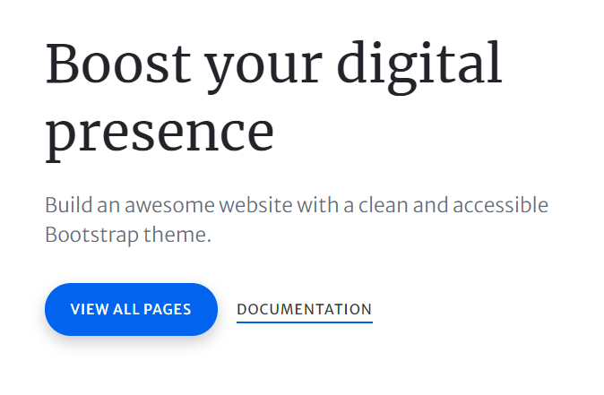

# Intro HTML CSS

## Setup for Web Development

1. [VSCode](https://code.visualstudio.com/)
    - Live server
    - Live share
    - Auto Close Tag
    - Auto Rename Tag
    - and more... explore (flex with your theme)
2. [Git](https://git-scm.com/)
3. [NodeJS - LTS](https://nodejs.org/en/)

## HTML and CSS Basics 

- [MDN DOCS](https://developer.mozilla.org/en-US/docs/Web/HTML/Element) as always
- [W3Schools](https://www.w3schools.com/html/default.asp) for interactive tutorials

## Homework

1. Complete your setup
2. Choose a theme :)
3. Make your choice:
    - Design a card with these elements  
      
    Don't forget about animations! [ref link](https://themes.getbootstrap.com/preview/?theme_id=23273)
    - Design a register form with these elements  
      
    Don't forget about animations! [ref link](https://themes.getbootstrap.com/preview/?theme_id=7340)
    - Design a card with these elements  
      
    Don't forget about animations! [ref link](https://themes.getbootstrap.com/preview/?theme_id=61529)
    - Design a card with these elements  
      
    Don't forget about animations! [ref link](https://themes.getbootstrap.com/preview/?theme_id=9177)  
    Too simple? Please add gradient effect on the blue button
### Hints ...shhhhh

    
Choice 1

    
- Take a look at <b>span</b> tag.

    
Choice 2

    
- You can research a little about centering... but don't stress too much.

    
- Look on how to put default text in inputs.

    
Choice 3

    
- Choose a photo with your favourite technology and make it as background for card heading

    
- Search for svg icons on "https://freeicons.io/" or any other website

    
- Search on css tooltips for the hover animation

    

    
Choice 4

    
- Search for css gradient

    